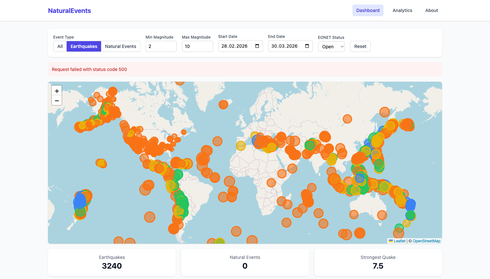

# NaturalEvents

Real-time earthquake and natural event monitoring dashboard. Built with React and Vue side by side in a shared monorepo, comparing both frameworks by implementing the same application twice.



## Features

- Interactive Leaflet map with earthquake and natural event markers
- Earthquake markers sized by magnitude and colored by depth
- EONET markers color-coded by category (wildfires, storms, volcanoes, etc.)
- Filter panel: event type toggle, magnitude range, date range, EONET status
- Stats bar showing earthquake count, natural event count, and strongest quake
- Analytics page with magnitude distribution bar chart and events-over-time line chart
- Event detail pages for individual earthquakes and EONET events
- Identical apps in React and Vue for framework comparison

## Tech Stack

| Area      | React App              | Vue App                  |
| --------- | ---------------------- | ------------------------ |
| Framework | React 19               | Vue 3.5                  |
| Routing   | React Router           | Vue Router               |
| State     | Zustand                | Pinia                    |
| Maps      | react-leaflet          | @vue-leaflet/vue-leaflet |
| Charts    | Recharts               | vue-chartjs + Chart.js   |
| Testing   | @testing-library/react | @vue/test-utils          |

**Shared:** TypeScript, Vite, Tailwind CSS, Vitest, Playwright, Storybook, Axios

## Project Structure

```
natural_events/
├── apps/
│   ├── react/          # React app
│   └── vue/            # Vue app
├── packages/
│   └── shared/         # Shared types and constants
├── .github/
│   └── workflows/      # CI pipeline
└── package.json        # Monorepo root (npm workspaces)
```

## Getting Started

### Prerequisites

- Node.js 18+
- npm 9+

### Install

```bash
npm install
```

## Scripts

### Development

| Command             | Description            |
| ------------------- | ---------------------- |
| `npm run dev:react` | Start React dev server |
| `npm run dev:vue`   | Start Vue dev server   |

### Storybook

| Command                   | Description                              |
| ------------------------- | ---------------------------------------- |
| `npm run storybook:react` | React Storybook on http://localhost:6006 |
| `npm run storybook:vue`   | Vue Storybook on http://localhost:6007   |

### Testing

| Command              | Description                 |
| -------------------- | --------------------------- |
| `npm run test`       | Run all tests (React + Vue) |
| `npm run test:react` | React tests only            |
| `npm run test:vue`   | Vue tests only              |
| `npm run e2e`        | Run Playwright E2E tests    |

### Build

| Command               | Description                |
| --------------------- | -------------------------- |
| `npm run build:react` | Production build for React |
| `npm run build:vue`   | Production build for Vue   |

### Bundle Analysis

| Command                 | Description                        |
| ----------------------- | ---------------------------------- |
| `npm run analyze:react` | Build React with bundle visualizer |
| `npm run analyze:vue`   | Build Vue with bundle visualizer   |

### Linting & Formatting

| Command                | Description                   |
| ---------------------- | ----------------------------- |
| `npm run lint`         | Run ESLint across both apps   |
| `npm run format`       | Format code with Prettier     |
| `npm run format:check` | Check formatting (used in CI) |

## E2E Testing

End-to-end tests use [Playwright](https://playwright.dev/) with a single config at the root. Two projects target each app on its own dev server:

- **React** — `http://localhost:3000` (Chromium)
- **Vue** — `http://localhost:3001` (Chromium)

The `webServer` property in `playwright.config.ts` starts both dev servers automatically before tests run.

```bash
npm run e2e                          # run all E2E tests
npx playwright test --project=react  # react only
npx playwright test --project=vue    # vue only
```

Test files live in `e2e/react/` and `e2e/vue/`. They cover page navigation, component rendering, and cross-page interactions.

## Performance Profiling

### Lighthouse

Both deployed apps were audited with Google Lighthouse. Reports and score screenshots are in `docs/`.

| App   | Performance | Accessibility | Best Practices | SEO |
| ----- | ----------- | ------------- | -------------- | --- |
| React | 56          | 100           | 96             | 92  |
| Vue   | 36          | 100           | 96             | 92  |

Performance scores are low due to Lighthouse simulating Slow 4G on a Moto G Power — the map tile loading from OpenStreetMap and live API calls to USGS/EONET dominate LCP. Accessibility, Best Practices, and SEO are all green (90+).

### Bundle Analysis

Bundle composition is visualized with `vite-bundle-analyzer`, gated behind `ANALYZE=true`.

```bash
npm run analyze:react   # opens treemap in browser
npm run analyze:vue     # opens treemap in browser
```

Code splitting via Vite `manualChunks` separates vendor, map, and chart libraries into their own chunks.

| App   | Total Size | Gzipped |
| ----- | ---------- | ------- |
| React | 824 KB     | 242 KB  |
| Vue   | 475 KB     | 161 KB  |

Screenshots: `docs/bundle-react.png`, `docs/bundle-vue.png`

## APIs

- [USGS Earthquake API](https://earthquake.usgs.gov/fdsnws/event/1/) — real-time seismic data from the U.S. Geological Survey
- [NASA EONET v3](https://eonet.gsfc.nasa.gov/docs/v3) — Earth Observatory Natural Event Tracker (wildfires, storms, volcanoes, etc.)

## CI/CD

GitHub Actions runs on every PR to `main` with two parallel jobs:

- **Lint, Format and Test** — ESLint, Prettier check, Vitest unit tests
- **E2E Tests** — installs Chromium, starts both dev servers, runs Playwright tests, uploads HTML report as artifact

## Deployment

Both apps deploy to Vercel from this monorepo.

- **React:** https://natural-events-react.vercel.app
- **Vue:** https://natural-events-vue.vercel.app

## License

MIT
